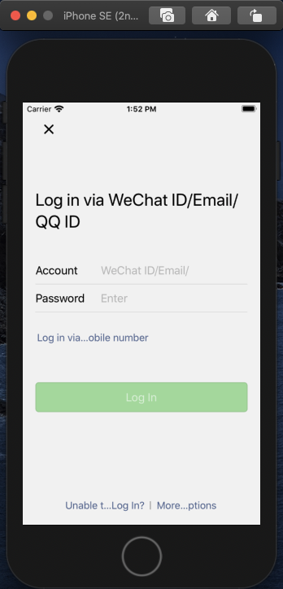
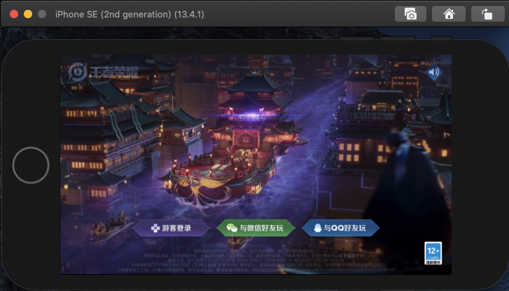

# Overview

## What is iqemu64?

iqemu64 is an iOS ARM64 emulator that runs commerical iOS apps you can find in official AppStore efficiently on an x86-64 based OSX system. iqemu64 is based on qemu as the name indicates.

## Prerequisites

1. Now it runs only on OSX Catalina 10.15.1-10.15.7 vanilla (Maybe other versions of OSX works fine too, not tested.) with Xcode 11.4.1 (Can be updated with minor work.), Simulator iOS version 13.4.1.
2. Apps you get from AppStore must be [decrypted](https://ivrodriguez.com/decrypting-ios-applications-ios-12-edition/) first. [Code signature free](https://stackoverflow.com/questions/44872071/removing-the-code-signature-from-a-mac-app-executable/44873442) Apps are preferable.
3. Apps must be ARM64 architecture. It can also be the FAT format, but at least an ARM64 architecture is required. A single ARMv7 or ARM64e architecture is not supported.

## WARNINGS

iqemu64 is consisted of many parts, one of which is a kernel extension that completely kills off the code signing verification of the OSX system. It makes your system vulnerable to attacks. Make sure you know what you are doing before using iqemu64. Of course, you can always unload the kernel extension or reboot to recover full code signing protection.


# Building

Disable [SIP](https://developer.apple.com/documentation/security/disabling_and_enabling_system_integrity_protection?language=objc).

Disable [Gatekeeper](https://disable-gatekeeper.github.io/). Some earlier models of iMac/macbook may not have to do this.

Make sure you have [Homebrew](https://brew.sh/) and Xcode Command Line Tools installed.

```
brew install pkg-config glib
git clone --recursive https://github.com/iqemu64/iqemu64.git
cd ${iqemu64_path}
sh ./setup.sh
```
You will know when you are done.

iqemu64 patches Xcode executables files only. It does **NOT** touch your system frameworks or kernel. The kernel extension does runtime memory patch only. If you want to recover Xcode patched files, use:

```
cd ${iqemu64_path}
sh ./restore.sh
```

Notes:  
- Currently the script works for **Catalina** and **Xcode 11.4.1** only.
- The script does backups and **patches** some of your Xcode binaries. You need to enter full path of your Xcode.app when running the script.
- The *make* command in the script will fail. It's OK.

After you have successfully setup, you need to run these cmds on EVERY boot before running Simulator and iOS apps. (OSX without the kernel extension refuses to run Xcode/Simulator since they are patched.)
```
sudo cp -r ${HOME}/Develop/kernels/iemukern.kext /tmp/
sudo kextutil -t /tmp/iemukern.kext
```

# Install iOS apps to the simulator

Unpack the ipa file with any zip archiver, expose the `.app` folder. 

Make sure you are installing apps to the Simulator of the patched Xcode if you have multiple Xcode versions installed. Install with:
```
xcrun simctl install <device> <pathOf.appFolder>
```

# Screenshots

App **WeChat** running:



Game **Arena of Valor** running:



# Known issues

1. Not all applications can run smoothly without crash due to the nature differences between the simulator and real devices. Only a small amount of apps are tested now. Many issues are fixed but more are coming. You can file an issue if you really want an app to run on iqemu64. If you find an app runnable on iqemu64, a feedback is always welcomed.
2. Metal support are very limited. You can find document from [Apple](https://developer.apple.com/documentation/metal/developing_metal_apps_that_run_in_simulator?language=objc). We can work a compatible layer but it is TBD.
3. OpenGLES implementation of Xcode iOS Simulator is a software renderer, hence program that uses OpenGLES is very slow. A hardware-based OpenGLES implementation is not open sourced for now.
4. Signal handler/mach exception port support is not full now, which means crash reporters of apps may not work.
5. Syscalls of iOS system are not supported yet.

# Contact us

Additional components that provides better debugging support, instruction level instrumentation framework for building dynamic analysis tools, detecting memory management bugs and more app compatiblities are not open sourced. You can send a mail to imoltencoreco#gmail.com if you are interested. Thoughts and feedbacks are also welcomed.